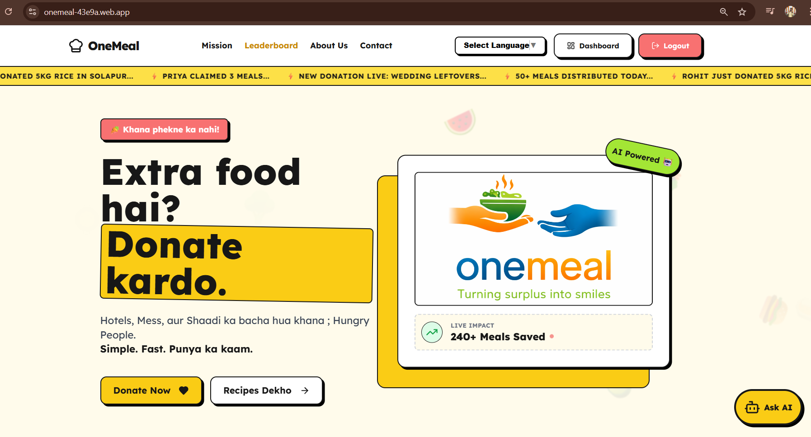
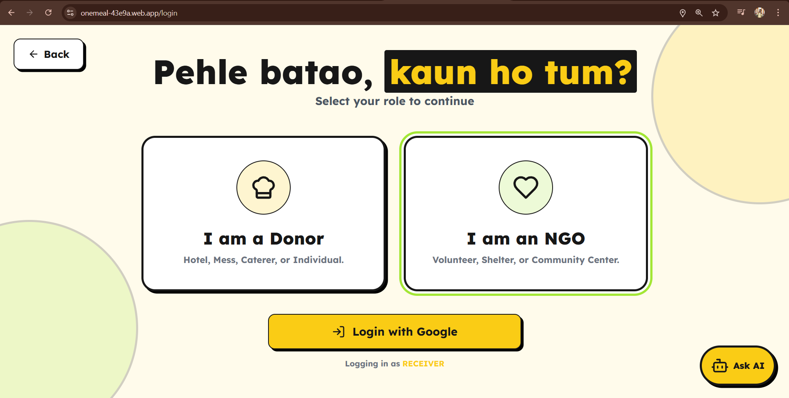
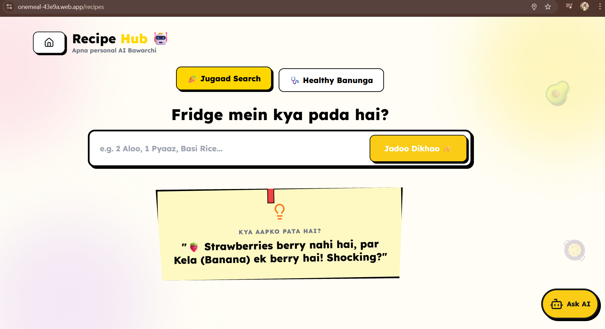

# 🥗 OneMeal - AI-Powered Food Donation Platform

> **Bridging the gap between surplus food and those in need with AI & Geo-tracking.**

OneMeal is a next-generation food donation system designed to minimize food waste and optimize distribution. It uses **Google Gemini AI** for food quality assessment and recipe generation, while ensuring seamless connectivity between Donors, NGOs, and Receivers via **Real-time Geolocation**.

---

## 🚀 Key Features

* **🤖 AI-Powered Quality Check:** Uses **Google Gemini API** to analyze uploaded food images, detecting freshness and estimating shelf life.
* **🍲 Smart Recipe Generation:** Suggests nutrition-aware recipes based on donated ingredients using GenAI.
* **🌍 Multi-Language Support:** Fully accessible in **Hindi & Marathi** using the **Google Translate API** for local community inclusion.
* **📍 Real-Time Tracking:** Live location tracking of donations and volunteers using **React Leaflet (OpenStreetMap)**.
* **🎨 Neo-Brutalism UI:** A bold, high-contrast design style using **Tailwind CSS** for maximum accessibility and modern aesthetics.
* **🔐 Secure & Scalable:** Powered by **Firebase Authentication** & **Firestore** for real-time data handling.

---

## 🛠️ Tech Stack

### **Frontend**
* **Framework:** React.js (Vite)
* **Language:** TypeScript (Strict Type Safety)
* **Styling:** Tailwind CSS (Neo-Brutalism Theme)
* **Animations:** Framer Motion
* **Icons:** Lucide React

### **Backend & Database**
* **Auth:** Firebase Authentication (Secure Login/Signup)
* **Database:** Firebase Firestore (NoSQL Real-time DB)

### **Artificial Intelligence**
* **Vision & NLP:** Google Gemini API (Freshness Detection & Recipes)
* **Localization:** Google Translate API

### **Tools & Utilities**
* **Maps:** React Leaflet
* **Notifications:** React Hot Toast
* **Routing:** React Router DOM

---

## 📸 Screenshots

## 📸 Screenshots

| Landing Page | Donor Dashboard |
| :---: | :---: |
  
   
   


---

## ⚙️ Installation & Setup

1.  **Clone the repository**
    ```bash
    git clone [https://github.com/Piyush4521/onemeal.git](https://github.com/Piyush4521/onemeal.git)
    cd onemeal
    ```

2.  **Install dependencies**
    ```bash
    npm install
    ```

3.  **Configure Environment Variables**
    Create a `.env` file in the root directory and add your keys:
    ```env
    VITE_FIREBASE_API_KEY=your_firebase_api_key
    VITE_GEMINI_API_KEY=your_gemini_api_key
    VITE_GOOGLE_TRANSLATE_KEY=your_translate_key
    ```

4.  **Run the development server**
    ```bash
    npm run dev
    ```

---

## 🤝 Contribution
Contributions are welcome! Please feel free to submit a Pull Request.

---
*Built with ❤️ by [Piyush] for a hunger-free world.*